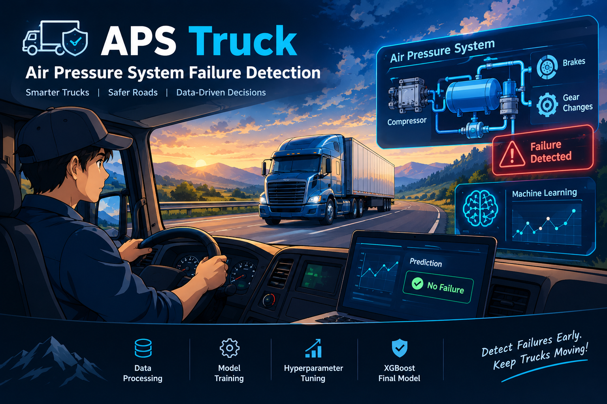
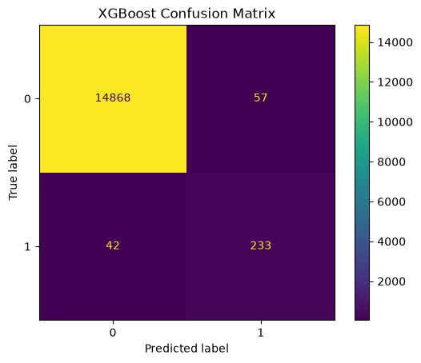
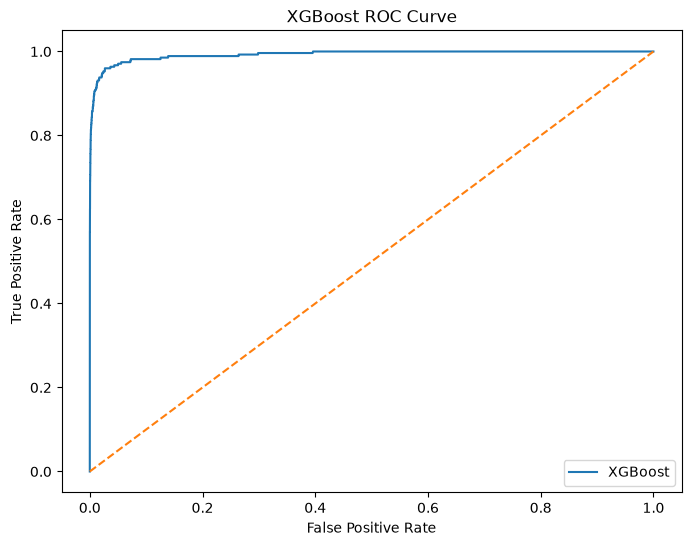

# 🚛 Detecting Air Pressure System Failure in Trucks

<div align="center">




</div>

---
## 📌 Project Overview

This project uses **Machine Learning to predict Air Pressure System (APS) component failures in heavy trucks**.

The dataset contains real-world truck sensor data with **missing values and a highly imbalanced target class**. The project covers the complete ML workflow — from data analysis and preprocessing to **SMOTE, model training, evaluation, and hyperparameter tuning**.

After comparing multiple classification models, **XGBoost** was selected as the final model and achieved:

**99.35% Accuracy | 84.73% Recall | 82.48% F1 Score | 99.28% ROC-AUC**

---

## 🎯 Motivation

I wanted to work on a real-world machine learning problem where the data is not perfectly clean and the model needs to handle practical challenges. The Air Pressure System is an important part of heavy trucks, especially for functions such as braking and gear changes.

While working on this project, I wanted to understand how machine learning can be applied to sensor data to identify possible component failures. The dataset also contains many missing values and a highly imbalanced target, which motivated me to learn how to handle these challenges properly instead of working only with simple, clean datasets.

This project helped me connect the concepts I learned in machine learning with a practical engineering problem and increased my interest in applying **AI and machine learning to real-world systems**.

---

## 🎯 Objective

My main objective in this project was to build a machine learning model that could predict whether an Air Pressure System (APS) component in a heavy truck could fail.

I wanted to understand the complete machine learning process, starting from **data preprocessing and handling missing values**, to dealing with the **imbalanced dataset**, training different classification models, and evaluating their performance.

I also wanted to compare different models and use **hyperparameter tuning** to improve the final model's performance. Through this project, my goal was not only to achieve good accuracy, but also to understand how machine learning can be applied to a real-world failure prediction problem.

---

## 📊 Dataset

The dataset used in this project is:

**APS Failure at Scania Trucks**

The dataset was obtained from the **UCI Machine Learning Repository**.

🔗 **Dataset:**  
https://archive.ics.uci.edu/ml/datasets/aps+failure+at+scania+trucks

### 📋 Dataset Information

<table>
<tr>
<th>📌 Information</th>
<th>📊 Details</th>
</tr>

<tr>
<td><b>Dataset</b></td>
<td>APS Failure at Scania Trucks</td>
</tr>

<tr>
<td><b>Source</b></td>
<td>UCI Machine Learning Repository</td>
</tr>

<tr>
<td><b>Problem Type</b></td>
<td>Binary Classification</td>
</tr>

<tr>
<td><b>Training Instances</b></td>
<td>60,000</td>
</tr>

<tr>
<td><b>Test Instances</b></td>
<td>16,000</td>
</tr>

<tr>
<td><b>Attributes</b></td>
<td>171</td>
</tr>

<tr>
<td><b>Feature Type</b></td>
<td>Integer and Real</td>
</tr>

<tr>
<td><b>Missing Values</b></td>
<td>Yes</td>
</tr>

<tr>
<td><b>Target</b></td>
<td><code>class</code></td>
</tr>

</table>

The positive class represents component failures for a specific component of the APS, while the negative class represents trucks with failures not related to the APS.

### 📚 Dataset Citation

> APS Failure at Scania Trucks [Dataset]. (2016). UCI Machine Learning Repository.

**DOI:** 10.24432/C51S51

---
## 🔄 Project Workflow

```text
🚛 Raw Dataset
       ↓
🔍 Data Understanding
       ↓
📊 EDA
       ↓
🧹 Data Preprocessing
       ↓
⚖️ SMOTE
       ↓
🤖 Model Training
       ↓
📈 Model Evaluation
       ↓
⚙️ Hyperparameter Tuning
       ↓
🏆 Final XGBoost Model
```    

---

## 🧹 Data Preprocessing

Before training the models, I prepared the dataset step by step to make it suitable for machine learning.

<div align="center">

| 🔧 Step | 📝 What I Did |
|---|---|
| 🧹 **Missing Values** | Handled missing values using **mean imputation** |
| ✂️ **Train / Test Split** | Prepared separate training and testing datasets |
| 📏 **Feature Scaling** | Scaled the numerical features to bring them to a similar range |
| ⚖️ **Class Imbalance** | Used **SMOTE** to balance the minority and majority classes in the training data |
| 📦 **Processed Dataset** | Created the final processed training and testing datasets for model training |

</div>

### ⚖️ Handling Class Imbalance

The dataset contains considerably fewer failure cases than non-failure cases.  
To address this problem, I used **SMOTE (Synthetic Minority Oversampling Technique)** on the training data.

```text
Original Training Data
        ↓
   Class Imbalance
        ↓
      SMOTE
        ↓
Balanced Training Data
        ↓
   Model Training
```
---

## 🤖 Machine Learning Models

I trained and compared different machine learning classification models to understand which algorithms perform well for the APS failure prediction problem.

| 🔧 Model | 💡 Purpose |
|---|---|
| 🧮 **Logistic Regression** | Baseline classification model |
| 📍 **KNN** | Classification based on nearby data points |
| 🌳 **Decision Tree** | Tree-based classification |
| 🌲 **Random Forest** | Ensemble of decision trees |
| 🎲 **Naive Bayes** | Probability-based classification |
| 📐 **SVM** | Finds a boundary between classes |
| 🚀 **AdaBoost** | Boosting-based ensemble model |
| 📈 **Gradient Boosting** | Sequential boosting model |
| ⚡ **XGBoost** | Optimized gradient boosting model |

After comparing the models, I further tuned their hyperparameters using **GridSearchCV** and **Optuna** to improve their performance.

---

## 📈 Model Evaluation

After training the different models, I evaluated their performance using **Accuracy, Precision, Recall, F1 Score, Confusion Matrix, and ROC-AUC**.

For the final evaluation, I focused on the **XGBoost model** because it performed best for this project.

---

### 🔲 Confusion Matrix

The confusion matrix helped me understand how well the final XGBoost model classified the **failure** and **non-failure** cases.

<div align="center">

<table>
<tr>
<td align="center" style="border: 5px solid #000000; padding: 15px;">



<br><br>

<b>📊 XGBoost Confusion Matrix</b>

</td>
</tr>
</table>

</div>

---

### 📈 ROC Curve

The ROC curve shows how well the final XGBoost model separates the **two classes**.

<div align="center">

<table>
<tr>
<td align="center" style="border: 5px solid #000000; padding: 15px;">



<br><br>

<b>📈 XGBoost ROC Curve</b>

</td>
</tr>
</table>

</div>

---

## ⚙️ Hyperparameter Tuning

After training and evaluating the models, I used hyperparameter tuning to find better parameter combinations and improve model performance.

### 🔧 Techniques Used

<table>
<tr>
<td align="center" style="border: 2px solid #222; padding: 15px;">

### 🔎 GridSearchCV

Systematically searches through a predefined set of parameter combinations to find a suitable configuration for a model.

</td>

<td align="center" style="border: 2px solid #222; padding: 15px;">

### 🧠 Optuna

Automatically searches for promising hyperparameter combinations using different trials.

</td>
</tr>
</table>

I used **GridSearchCV and Optuna** for the machine learning models and compared the tuned results to select a suitable final model.

---

## 🏆 Final Model

After comparing the models and performing hyperparameter tuning, **XGBoost** was selected as the final model for this project.

### 📊 Final XGBoost Performance

<table>
<tr>
<th>📌 Metric</th>
<th>📈 Score</th>
</tr>

<tr>
<td>🎯 Accuracy</td>
<td><b>99.35%</b></td>
</tr>

<tr>
<td>🎯 Precision</td>
<td><b>80.34%</b></td>
</tr>

<tr>
<td>🔍 Recall</td>
<td><b>84.73%</b></td>
</tr>

<tr>
<td>⚖️ F1 Score</td>
<td><b>82.48%</b></td>
</tr>

<tr>
<td>📈 ROC-AUC</td>
<td><b>99.28%</b></td>
</tr>

</table>

---

## 📊 Final Model Results

The following visual shows the final model performance:

<div align="center">

<table>
<tr>
<td align="center" style="border: 4px solid #000000; padding: 15px;">


<br><br>

<b>🏆 Final XGBoost Model Results</b>

</td>
</tr>
</table>

</div>

---

## 🧠 Skills Acquired

During this project, I developed practical experience in the complete machine learning workflow.

<table>
<tr>
<th>🧩 Area</th>
<th>💡 Skills</th>
</tr>

<tr>
<td><b>Data Preparation</b></td>
<td>Data preprocessing, missing value handling, feature scaling</td>
</tr>

<tr>
<td><b>Data Analysis</b></td>
<td>Exploratory Data Analysis (EDA)</td>
</tr>

<tr>
<td><b>Machine Learning</b></td>
<td>Binary classification, model training, model comparison</td>
</tr>

<tr>
<td><b>Imbalanced Data</b></td>
<td>SMOTE and minority-class handling</td>
</tr>

<tr>
<td><b>Model Evaluation</b></td>
<td>Accuracy, Precision, Recall, F1 Score, Confusion Matrix, ROC-AUC</td>
</tr>

<tr>
<td><b>Model Optimization</b></td>
<td>GridSearchCV and Optuna</td>
</tr>

<tr>
<td><b>Final Model</b></td>
<td>XGBoost</td>
</tr>

<tr>
<td><b>End-to-End Workflow</b></td>
<td>From raw data preparation to final prediction</td>
</tr>

</table>

---

## 🛠️ Tools & Technologies

<table>
<tr>
<th>🛠️ Category</th>
<th>💻 Technologies</th>
</tr>

<tr>
<td><b>Programming</b></td>
<td>Python</td>
</tr>

<tr>
<td><b>Data Processing</b></td>
<td>Pandas, NumPy</td>
</tr>

<tr>
<td><b>Visualization</b></td>
<td>Matplotlib, Seaborn</td>
</tr>

<tr>
<td><b>Machine Learning</b></td>
<td>Scikit-learn</td>
</tr>

<tr>
<td><b>Imbalanced Data</b></td>
<td>SMOTE</td>
</tr>

<tr>
<td><b>Boosting</b></td>
<td>XGBoost, AdaBoost, Gradient Boosting</td>
</tr>

<tr>
<td><b>Hyperparameter Tuning</b></td>
<td>GridSearchCV, Optuna</td>
</tr>

<tr>
<td><b>Development</b></td>
<td>Jupyter Notebook, VS Code</td>
</tr>

<tr>
<td><b>Version Control</b></td>
<td>Git, GitHub</td>
</tr>

</table>